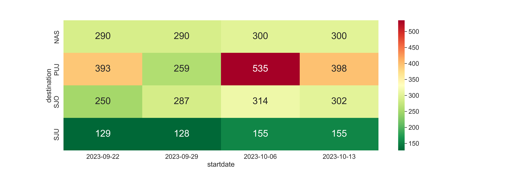
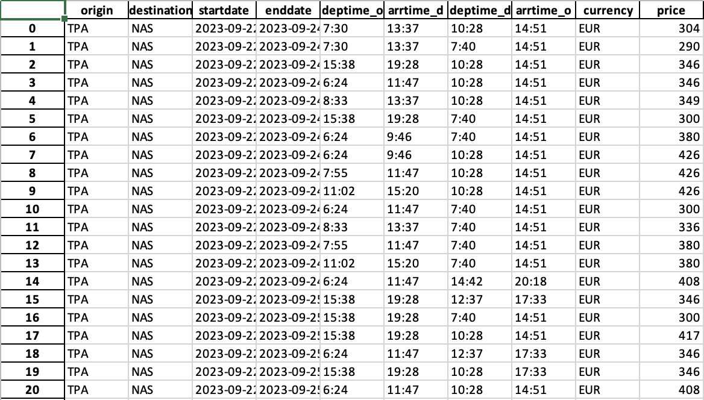

# Optimal_Flight_Prices


This Python script is designed to scrape flight data from the flight comparison website Kayak and generate a trip summary and heatmap based on the scraped data. It utilizes the BeautifulSoup, selenium, seaborn, matplotlib, and pandas libraries to achieve its functionality. 

## Sample Output
Heatmap:


Excel:


## Getting Started
These instructions will get you a copy of the project up and running on your local machine for development and testing purposes.

### Installing
1. Make sure you have Python installed on your system (version 3.6 or later).

2. Clone the repository to your local machine
```
git clone https://github.com/JiGro/Optimal_Flight_Prices.git
```

3. Install the required packages
```
pip install -r requirements.txt
```

4. Set ENV Variables 
```
########################################################################
airport_codes = ['NAS', 'SJO', 'PUJ', 'SJU']
destinations = ['Nassau', 'San Jose', 'Punta Cana', 'San Juan']
startdates = ['2023-09-22', '2023-09-29', '2023-10-06', '2023-10-06', '2023-10-13']
length_of_stay = [2, 3]
########################################################################
```

5. Run the code using the following command:
```
python flights_optimizer.py
```

## Authors
- **Jimmy (JiGro)** - *Initial work* - [My Github Profile](https://github.com/JiGro)
